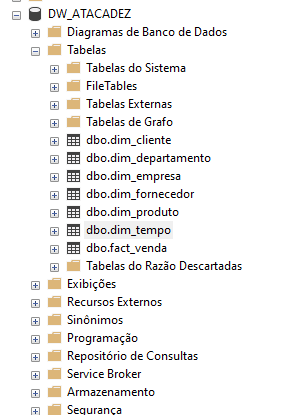

# Projeto de Modelagem de Banco de Dados - Data Warehouse

## 1. Introdução

Este projeto visa a construção de um **Data Warehouse** eficiente e estruturado para integrar e organizar os dados de vendas, compras e rentabilidade da empresa, possibilitando uma análise profunda e estratégica dos seus processos de negócios. O objetivo é proporcionar insights detalhados sobre o desempenho das transações, otimizando a tomada de decisões com base em informações consolidadas e acessíveis.

A modelagem do **Data Warehouse** foi desenvolvida com base em diversas **dimensões** e **hierarquias** que estruturam os dados de maneira flexível e organizada. As principais dimensões envolvidas no projeto incluem **CLIENTE**, **PRODUTO**, **EMPRESA**, e **TEMPO**, com suas respectivas hierarquias e atributos, que garantem uma análise detalhada em diferentes níveis de granularidade, desde o cliente até o período da transação.

Além disso, a estrutura contempla indicadores chave de desempenho, como **quantidade vendida**, **valor da venda**, **lucro** e **rentabilidade**, que são calculados a partir de dados de entrada (**inputs**) e ajudam a medir o desempenho da empresa de forma clara e objetiva.

Este **Data Warehouse** será uma ferramenta essencial para a análise estratégica, permitindo à equipe de gestão e aos analistas de dados realizar consultas eficientes e gerar relatórios completos sobre os diversos aspectos da operação da empresa. Com a integração e organização dos dados, a empresa poderá identificar tendências, otimizar processos e melhorar a rentabilidade de suas operações.

## 2. Objetivo do Projeto

O principal objetivo deste projeto é criar uma infraestrutura robusta de **Data Warehouse** para suportar a análise estratégica dos dados de vendas e compras da empresa. Através da integração e organização de múltiplas dimensões, queremos possibilitar uma visão clara sobre o desempenho de vendas, rentabilidade e outras métricas críticas para a tomada de decisões da empresa.

## 3. Modelagem do Data Warehouse

A modelagem do **Data Warehouse** foi construída com base nas seguintes dimensões principais e suas hierarquias:

### 3.1 Dimensão CLIENTE

- **Nível Input**: Cliente (CNPJ e Nome do Cliente)
- **Atributos**:
  - Tamanho do Cliente
- **Hierarquias**:
  - **Geográfica de Cliente**:
    - Cliente
    - Cidade
    - Estado
    - Região
  - **Segmento**:
    - Cliente
    - Segmento

### 3.2 Dimensão PRODUTO

- **Nível Input**: Produto (SKU e Nome do Produto)
- **Atributos**:
  - Unidade de Medida
- **Hierarquias**:
  - **Fornecedor**:
    - Produto
    - Fornecedor do Produto
  - **Departamento**:
    - Produto
    - Departamento
  - **Setor**:
    - Produto
    - Setor

### 3.3 Dimensão EMPRESA

- **Nível Input**: Loja (Identificador e Nome da Loja)
- **Atributos**:
  - Tipo da Loja
- **Hierarquias**:
  - **Empresa**:
    - Loja
    - Empresa (CNPJ e Nome da Empresa)

### 3.4 Dimensão TEMPO

- **Nível Input**: Data (Dia, mês, ano) - AAAAMMDD
- **Atributos**:
  - Dia da Semana
  - Fim de Semana
- **Hierarquias**:
  - **Calendário**:
    - Dia
    - Mês
    - Trimestre
    - Semestre
    - Ano

## 4. Indicadores

Os indicadores principais do projeto são calculados a partir de dados de entrada (**inputs**) e têm como objetivo fornecer insights claros sobre o desempenho da empresa. Os **Inputs** utilizados para os cálculos são:

### 4.1 Inputs

- **Quantidade Vendida**: Total de unidades vendidas de um determinado produto.
- **Valor da Venda**: O valor total gerado pela venda (Quantidade Vendida \* Preço Unitário de Venda).
- **Preço Unitário de Compra (Input)**: O preço pago pela unidade do produto (custo de aquisição).

### 4.2 Calculados

- **Custo de Venda**:  
  Custo de Venda = Preço Unitário de Compra (Input) \* Quantidade Vendida

- **Preço Unitário de Venda**:  
  Preço Unitário de Venda = Valor da Venda / Quantidade Vendida

- **Preço Unitário de Compra**:  
  Preço Unitário de Compra = Custo de Venda / Quantidade Vendida

- **Lucro**:  
  Lucro = Valor da Venda - Custo de Venda

- **Rentabilidade**:  
  Rentabilidade = (Lucro / Valor da Venda) \* 100

## 5. Matriz Dimensão x Indicador

A tabela abaixo apresenta a relação entre as dimensões e os indicadores do projeto:

| Indicador                | CLIENTE | PRODUTO | EMPRESA | TICKET | TEMPO |
| ------------------------ | ------- | ------- | ------- | ------ | ----- |
| Quantidade Vendida       | X       | X       | X       | X      | X     |
| Preço Unitário de Venda  | X       | X       | X       | X      | X     |
| Valor da Venda           | X       | X       | X       | X      | X     |
| Preço Unitário de Compra | X       | X       | X       | X      | X     |
| Custo de Venda           | X       | X       | X       | X      | X     |
| Lucro                    | X       | X       | X       | X      | X     |
| Rentabilidade            | X       | X       | X       | X      | X     |

Essa matriz define quais dimensões estão relacionadas com cada indicador, garantindo que a modelagem do **Data Warehouse** esteja bem estruturada para análises futuras.

# Construção do Data Warehouse

## Contexto e Objetivo

O objetivo dessa etapa é desenvolver um **Data Warehouse (DW)** para análise de **vendas, clientes, produtos e tempo**. O DW será composto por **tabelas dimensionais** que irão alimentar as **tabelas de fatos** para realizar análises de forma eficiente. Utilizamos o conceito de **matriz-dimensão** para estruturar a criação das tabelas.

## Ferramenta Utilizada

A ferramenta utilizada para a criação do Data Warehouse é a **Power Architect**, uma plataforma **low-code** que facilita o desenvolvimento do código e a integração com o banco de dados. A utilização dessa ferramenta possibilita:

- Construção do modelo relacional de forma simplificada.
- Criação de consultas e integrações entre as tabelas.

## Estrutura do Banco de Dados

Para estruturar o Data Warehouse, foi necessário entender as dimensões que envolvem as análises de vendas e clientes.

- **Tabelas dimensionais**: construídas com chaves primárias e campos de descritores.
- **Tabelas de fato**: contêm dados quantitativos (como **quantidade vendida, valor de venda e custo de venda**) e uma chave composta construida a partir da junção das chaves primarias de cada uma das dimensões.

---

## Tabelas Dimensão

Cada tabela de dimensão contém um identificador único (**chave primária**), um código natural, descritor e atributos adicionais para descrever a entidade.

### `dim_tempo`

Contém informações sobre datas, estruturada da seguinte forma:

- `id_dia`: Chave primária.
- `cod_dia`: Código do dia.
- `data`: Data completa.
- `atr_dia_semana`: Dia da semana.
- `atr_fim_de_semana`: Flag que indica se é fim de semana.
- `cod_mes`: Código do mês.
- `desc_mes`: Descrição do mês.
- `cod_trimestre`: Código do trimestre.
- `desc_trimestre`: Descrição do trimestre.
- `cod_semestre`: Código do semestre.
- `desc_semestre`: Descrição do semestre.
- `cod_ano`: Código do ano.

### `dim_departamento`

Armazena informações sobre os setores de produtos:

- `cod_setor`: Código do setor (**chave primária**).
- `desc_setor`: Descrição do setor.

### `dim_fornecedor`

Armazena os dados dos fornecedores:

- `cod_fornecedor`: Código do fornecedor (**chave primária**).
- `desc_fornecedor`: Descrição do fornecedor.

### `dim_produto`

Armazena os dados dos produtos:

- `id_produto`: Chave primária (**gerada automaticamente**).
- `cod_produto`: Código do produto.
- `cod_fornecedor`: Código do fornecedor.
- `atr_unidade_medida`: Unidade de medida.
- `cod_setor`: Código do setor.
- `desc_produto`: Descrição do produto.

### `dim_cliente`

Armazena os dados dos clientes:

- `id_cliente`: Chave primária (**gerada automaticamente**).
- `cod_cliente`: Código do cliente.
- `desc_cliente`: Descrição do cliente.
- `atr_tamanho_cliente`: Tamanho do cliente.
- `cod_cidade`: Código da cidade.
- `desc_cidade`: Descrição da cidade.
- `cod_estado`: Código do estado.
- `desc_estado`: Descrição do estado.
- `cod_regiao`: Código da região.
- `desc_regiao`: Descrição da região.
- `cod_segmento`: Código do segmento.
- `desc_segmento`: Descrição do segmento.

### `dim_empresa`

Armazena os dados da loja e da empresa:

- `id_loja`: Chave primária (**gerada automaticamente**).
- `cod_loja`: Código da loja.
- `atr_tipo_loja`: Tipo da loja.
- `desc_empresa`: Descrição da empresa.
- `cod_empresa`: Código da empresa.
- `desc_loja`: Descrição da loja.

---

## Tabela Fato

A tabela de fato **fact_venda** registra as vendas realizadas e relaciona as dimensões:

- `id_loja`: Chave estrangeira (**referenciando `dim_empresa`**).
- `id_cliente`: Chave estrangeira (**referenciando `dim_cliente`**).
- `id_produto`: Chave estrangeira (**referenciando `dim_produto`**).
- `id_dia`: Chave estrangeira (**referenciando `dim_tempo`**).
- `quantidade_vendida`: Quantidade de produtos vendidos.
- `valor_venda`: Valor da venda.
- `custo_venda`: Custo da venda.

Essa tabela será usada para **consultas e relatórios de vendas** por diversos filtros (**tempo, cliente, produto, etc.**).

---

## Criação do Banco de Dados

A criação do banco de dados foi feita por meio de **SQL**, seguindo estas etapas:

1. **Criação das tabelas dimensionais**: Com chaves primárias e descritores.
2. **Criação da tabela de fatos**: Incluindo as chaves primárias das dimensões e indicadores de entrada.
3. **Definição das relações**: Ligação entre a tabela de fatos e as tabelas dimensionais por meio de **chaves estrangeiras**.
4. **Inserção de dados nulos**: Para evitar **erros de cadastro e perda de dados**, foram inseridas linhas nulas em cada tabela de dimensão.


---

## Código do DW gerado pela ferramenta e corrigido de acordo com a versão do SQL utilizada

```sql
-- Definindo o modo de recuperação do banco de dados como SIMPLES
ALTER DATABASE [DW_ATACADEZ] SET RECOVERY SIMPLE;

-- Criando as tabelas dimensionais
CREATE TABLE dbo.dim_tempo (
    id_dia INT IDENTITY(1,1) NOT NULL,
    cod_dia VARCHAR(25) NOT NULL,
    data DATETIME NOT NULL,
    atr_dia_semana VARCHAR(50) NOT NULL,
    atr_fim_de_semana BIT NOT NULL,
    cod_mes VARCHAR(25) NOT NULL,
    desc_mes VARCHAR(200) NOT NULL,
    cod_trimestre VARCHAR(25) NOT NULL,
    desc_trimestre VARCHAR(200) NOT NULL,
    cod_semestre VARCHAR(25) NOT NULL,
    desc_semestre VARCHAR(200) NOT NULL,
    cod_ano VARCHAR(25) NOT NULL,
    CONSTRAINT dim_tempo_pk PRIMARY KEY (id_dia)
);

CREATE TABLE dbo.dim_departamento (
    cod_setor VARCHAR(25) NOT NULL,
    desc_setor VARCHAR(200) NOT NULL,
    CONSTRAINT dim_departamento_pk PRIMARY KEY (cod_setor)
);

CREATE TABLE dbo.dim_fornecedor (
    cod_fornecedor VARCHAR(25) NOT NULL,
    desc_fornecedor VARCHAR(200) NOT NULL,
    CONSTRAINT dim_fornecedor_pk PRIMARY KEY (cod_fornecedor)
);

CREATE TABLE dbo.dim_produto (
    id_produto INT IDENTITY(1,1) NOT NULL,
    cod_produto VARCHAR(25) NOT NULL,
    cod_fornecedor VARCHAR(25) NOT NULL,
    atr_unidade_medida VARCHAR(50) NOT NULL,
    cod_setor VARCHAR(25) NOT NULL,
    desc_produto VARCHAR(200) NOT NULL,
    CONSTRAINT dim_produto_pk PRIMARY KEY (id_produto)
);

CREATE TABLE dbo.dim_cliente (
    id_cliente INT IDENTITY(1,1) NOT NULL,
    cod_cliente VARCHAR(25) NOT NULL,
    desc_cliente VARCHAR(200) NOT NULL,
    atr_tamanho_cliente VARCHAR(50) NOT NULL,
    cod_cidade VARCHAR(25) NOT NULL,
    desc_cidade VARCHAR(200) NOT NULL,
    cod_estado VARCHAR(25) NOT NULL,
    desc_estado VARCHAR(200) NOT NULL,
    cod_regiao VARCHAR(25) NOT NULL,
    desc_regiao VARCHAR(200) NOT NULL,
    cod_segmento VARCHAR(25) NOT NULL,
    desc_segmento VARCHAR(200) NOT NULL,
    CONSTRAINT dim_cliente_pk PRIMARY KEY (id_cliente)
);

CREATE TABLE dbo.dim_empresa (
    id_loja INT IDENTITY(1,1) NOT NULL,
    cod_loja VARCHAR(25) NOT NULL,
    atr_tipo_loja VARCHAR(50) NOT NULL,
    desc_empresa VARCHAR(200) NOT NULL,
    cod_empresa VARCHAR(25) NOT NULL,
    desc_loja VARCHAR(200) NOT NULL,
    CONSTRAINT dim_empresa_pk PRIMARY KEY (id_loja)
);

-- Criando a tabela de fatos
CREATE TABLE dbo.fact_venda (
    id_loja INT NOT NULL,
    id_cliente INT NOT NULL,
    id_produto INT NOT NULL,
    id_dia INT NOT NULL,
    quantidade_vendida REAL NOT NULL,
    valor_venda REAL NOT NULL,
    custo_venda REAL NOT NULL,
    CONSTRAINT fact_venda_pk PRIMARY KEY (id_loja, id_cliente, id_produto, id_dia)
);

-- Adicionando as chaves estrangeiras para as tabelas de dimensão
ALTER TABLE dbo.fact_venda
ADD CONSTRAINT dim_tempo_fact_venda_fk
FOREIGN KEY (id_dia)
REFERENCES dbo.dim_tempo (id_dia)
ON DELETE NO ACTION
ON UPDATE NO ACTION;

ALTER TABLE dbo.dim_produto
ADD CONSTRAINT dim_departamento_dim_produto_fk
FOREIGN KEY (cod_setor)
REFERENCES dbo.dim_departamento (cod_setor)
ON DELETE NO ACTION
ON UPDATE NO ACTION;

ALTER TABLE dbo.dim_produto
ADD CONSTRAINT dim_fornecedor_dim_produto_fk
FOREIGN KEY (cod_fornecedor)
REFERENCES dbo.dim_fornecedor (cod_fornecedor)
ON DELETE NO ACTION
ON UPDATE NO ACTION;

ALTER TABLE dbo.fact_venda
ADD CONSTRAINT dim_produto_fact_venda_fk
FOREIGN KEY (id_produto)
REFERENCES dbo.dim_produto (id_produto)
ON DELETE NO ACTION
ON UPDATE NO ACTION;

ALTER TABLE dbo.fact_venda
ADD CONSTRAINT dim_cliente_fact_venda_fk
FOREIGN KEY (id_cliente)
REFERENCES dbo.dim_cliente (id_cliente)
ON DELETE NO ACTION
ON UPDATE NO ACTION;

ALTER TABLE dbo.fact_venda
ADD CONSTRAINT dim_empresa_fact_venda_fk
FOREIGN KEY (id_loja)
REFERENCES dbo.dim_empresa (id_loja)
ON DELETE NO ACTION
ON UPDATE NO ACTION;
```

---

## Tratamento do Lookup

### Depois disso devemos criar as linhas nulas de cada tabela para evitar erros de cadastro e perda de dados futuramente.

```sql
-- Ativando o INSERT na tabela dim_cliente
SET IDENTITY_INSERT dim_cliente ON
GO

-- Inserindo dados na tabela dim_cliente
INSERT INTO [dbo].[dim_cliente]
([id_cliente], [cod_cliente], [desc_cliente], [atr_tamanho_cliente],
 [cod_cidade], [desc_cidade], [cod_estado], [desc_estado],
 [cod_regiao], [desc_regiao], [cod_segmento], [desc_segmento])
VALUES
(0, 'ND', 'ND', 'ND', 'ND', 'ND', 'ND', 'ND', 'ND', 'ND', 'ND', 'ND')
GO

-- Desativando o INSERT na tabela dim_cliente
SET IDENTITY_INSERT dim_cliente OFF
GO

-- Selecionando os dados da tabela dim_cliente
SELECT * FROM dim_cliente
GO

-- Usando o banco de dados DW_ATACADEZ
USE [DW_ATACADEZ]
GO

-- Inserindo dados na tabela dim_departamento
INSERT INTO [dbo].[dim_departamento]
([cod_setor], [desc_setor])
VALUES
('ND', 'ND')
GO

-- Inserindo dados na tabela dim_fornecedor
INSERT INTO [dbo].[dim_fornecedor]
([cod_fornecedor], [desc_fornecedor])
VALUES
('ND', 'ND')
GO

-- Ativando o INSERT na tabela dim_produto
SET IDENTITY_INSERT dim_produto ON
GO

-- Inserindo dados na tabela dim_produto
INSERT INTO [dbo].[dim_produto]
([id_produto], [cod_produto], [cod_fornecedor], [atr_unidade_medida],
 [cod_setor], [desc_produto])
VALUES
(0, 'ND', 'ND', 'ND', 'ND', 'ND')
GO

-- Desativando o INSERT na tabela dim_produto
SET IDENTITY_INSERT dim_produto OFF
GO

-- Ativando o INSERT na tabela dim_empresa
SET IDENTITY_INSERT dim_empresa ON
GO

-- Inserindo dados na tabela dim_empresa
INSERT INTO [dbo].[dim_empresa]
([id_loja], [cod_loja], [atr_tipo_loja], [desc_empresa], [cod_empresa], [desc_loja])
VALUES
(0, 'ND', 'ND', 'ND', 'ND', 'ND')
GO

-- Desativando o INSERT na tabela dim_empresa
SET IDENTITY_INSERT dim_empresa OFF
GO

-- Ativando o INSERT na tabela dim_tempo
SET IDENTITY_INSERT dim_tempo ON
GO

-- Inserindo dados na tabela dim_tempo
INSERT INTO [dbo].[dim_tempo]
([id_dia], [cod_dia], [data], [atr_dia_semana], [atr_fim_de_semana],
 [cod_mes], [desc_mes], [cod_trimestre], [desc_trimestre],
 [cod_semestre], [desc_semestre], [cod_ano])
VALUES
(0, 'ND', '1900-01-01 00:00:00', 'ND', 0, 'ND', 'ND', 'ND', 'ND', 'ND', 'ND', 'ND')
GO

-- Desativando o INSERT na tabela dim_tempo
SET IDENTITY_INSERT dim_tempo OFF
GO

-- Selecionando os dados de todas as tabelas
SELECT * FROM dim_cliente
SELECT * FROM dim_departamento
SELECT * FROM dim_empresa
SELECT * FROM dim_fornecedor
SELECT * FROM dim_produto
SELECT * FROM dim_tempo
SELECT * FROM fact_venda
GO

-- Retornando ao banco de dados DW_ATACADEZ
USE [DW_ATACADEZ]
GO
```

## Banco de dados criado no SQL Server



# Estrutura e Processos para Criação do Data Lake

## Introdução

No contexto do nosso projeto, a criação de um **Data Lake** visa organizar e armazenar os dados recebidos de fontes externas para que possam ser processados e transformados para análise e uso posterior. A seguir, descrevemos a estrutura de diretórios e o processo de recebimento de arquivos, com foco na organização dos dados brutos fornecidos pela TI da AtacaDez (Empresa fictícia).

## Estrutura de Diretórios

A estrutura de diretórios foi projetada para garantir um fluxo de dados claro e organizado. A área de TI da AtacaDez será responsável por enviar os arquivos nos formatos Excel, CSV, JSON e XML. Esses arquivos serão recebidos em um diretório de **entrada** e, posteriormente, serão processados.

### Diretórios Criados

Dentro do diretório **Fontes**, já estabelecido no projeto, foi criado o seguinte:

1. **ETL**: Diretório que armazena os dados brutos enviados pela TI da AtacaDez.
2. **PROJETOS**: Diretório para armazenamento de dados relacionados aos projetos em andamento.
3. **DATA**: Diretório para armazenar os dados que serão gravados no Data Lake, estruturado da seguinte forma:
   - **DIMENSOES**: Diretório para dados dimensionais, contendo subdiretórios para:
     - **CLIENTE**
     - **PRODUTO**
     - **EMPRESA**
   - **FATOS**: Diretório reservado para dados de fato.

Dentro de cada subdiretório de **DIMENSOES**, criamos um subdiretório **IN**, que servirá como diretório de entrada para os arquivos externos.

### Caminhos dos Arquivos

Os arquivos serão armazenados nos seguintes caminhos conforme a estrutura criada:

- **CLIENTE**: Arquivos `CADASTRO DE CLIENTES.xlsx` e `REGIOES DOS ESTADOS.csv` são colocados em `DATA > DIMENSOES > CLIENTE > IN`.
- **EMPRESA**: Arquivo `EMPRESA.CSV` é colocado em `DATA > DIMENSOES > EMPRESA > IN`.
- **PRODUTO**: Arquivos `PRODUTOS.JSON` e `FORNECEDORES.XML` são colocados em `DATA > DIMENSOES > PRODUTO > IN`.

### Processo de Recebimento de Arquivos

A TI da AtacaDez será responsável por enviar os arquivos para os diretórios de entrada (**IN**) correspondentes, de acordo com o tipo de dado. Esses arquivos, ao chegarem nos diretórios de **entrada**, estarão prontos para serem lidos e processados pelo sistema.

## Etapas do Processo de Criação do Data Lake

1. **Recebimento dos Arquivos**:
   - A TI da AtacaDez envia os arquivos nos formatos especificados para os diretórios de entrada correspondentes (CLIENTE, EMPRESA, PRODUTO).
2. **Estrutura de Diretórios**:
   - Criamos a estrutura de diretórios **DATA > DIMENSOES** para armazenar os dados dimensionais e o diretório **IN** para receber os arquivos de forma organizada.
3. **Movimento de Arquivos**:
   - Após a criação da estrutura, os arquivos de exemplo são copiados da pasta **ETL** para seus respectivos diretórios de entrada:
     - `EMPRESA.CSV` em `DATA > DIMENSOES > EMPRESA > IN`
     - `CADASTRO DE CLIENTES.xlsx` e `REGIOES DOS ESTADOS.csv` em `DATA > DIMENSOES > CLIENTE > IN`
     - `PRODUTOS.JSON` e `FORNECEDORES.XML` em `DATA > DIMENSOES > PRODUTO > IN`

## Resumo da etapa

Com a estrutura de diretórios montada e os arquivos organizados, estamos prontos para seguir para a próxima etapa do projeto, que envolve a extração e carga desses dados no Data Lake. Esse processo de organização facilita a gestão dos dados e garante que os arquivos sejam manipulados de maneira sistemática e eficiente.

# Processamento e Movimentação de Arquivos no Data Lake

Este processo descreve como os arquivos de dados são movidos do diretório de entrada (IN) para o diretório de saída (OUT) no nosso Data Lake, como parte da carga da tabela de fato. O fluxo inclui a leitura de arquivos fonte, o processamento dos dados e a movimentação para o histórico. Abaixo, detalho as etapas seguidas no Visual Studio para configurar e testar a tarefa de movimentação de arquivos.

## Etapas do Processo

### 1. Fluxo de Controle

No Visual Studio, criamos um fluxo de controle que envolve três componentes principais:

- **Carga de Empresas**
- **Carga de Clientes**
- **Carga de Produtos**

Abaixo de **Carga de Empresas**, temos a tarefa **Carga de Notas Fiscais**, e logo abaixo, o componente **Movendo arquivo do diretório IN para diretório OUT - Notas**.

### 2. Configuração do Componente de Tarefa de Sistema de Arquivos

- **Conexão de Origem**: A conexão de origem é definida como **"Conexão com o arquivo NOTAS CSV"**, que aponta para os arquivos no diretório **IN**.
- **Conexão de Destino**: Para a conexão de destino, criamos a **"Conexão com o arquivo NOTAS CSV - OUT"** que aponta para o diretório **OUT**.

  Antes de configurar a tarefa, copiamos manualmente o arquivo do diretório **IN** para **OUT**, apenas para criar a conexão de destino.

### 3. Criação da Conexão de Destino

No **Gerenciador de Conexões**, adicionamos uma nova conexão **FLATFILE** e nomeamos como **"Leitura de arquivo NOTAS CSV - OUT"**. O caminho do diretório **OUT** é especificado para que o arquivo seja movido para lá após o processamento.

### 4. Configuração da Tarefa de Mover Arquivo

A tarefa de mover o arquivo é configurada da seguinte forma:

- **Fonte**: **"Conexão com o arquivo NOTAS CSV"**.
- **Destino**: **"Conexão com o arquivo NOTAS CSV - OUT"**.
- **Opção OverwriteDestination**: Definida como **True** para garantir que o arquivo de destino seja sobrescrito, caso já exista.
- **Operação**: A operação escolhida é **"Mover arquivo"**, e não uma cópia.

### 5. Teste da Tarefa

Para testar o processo, removemos o arquivo do diretório **OUT**, garantindo que ele só exista no diretório **IN**. Em seguida, executamos a tarefa **"Movendo arquivo do diretório IN para diretório OUT - Notas"**.

Ao executar a tarefa, o símbolo verde indica que o processo foi bem-sucedido, e o arquivo foi movido do diretório **IN** para **OUT**, concluindo a tarefa com sucesso.

## Objetivo

O objetivo deste processo é garantir que os arquivos de entrada sejam processados corretamente e movidos para o diretório de histórico (OUT), mantendo a organização e a integridade dos dados no Data Lake.

## Estrutura geral da carga do DL

### Lembrando que cada item desse fluxo tem seu processo interno de extração de dados dos arquivos origem, tratamento e carga na sua tabela. O que, por fim, gera o fluxo abaixo, o qual é responsavel por carregar todo o Data Lake.


# Carga do Data Warehouse

## Visão Geral

Esta etapa descreve o processo de ETL utilizado para carregar dados de um Data Lake para um Data Warehouse, otimizando-os para análise. O processo envolve extração, transformação, aplicação de regras de negócio e carga estruturada dos dados.

## Processo de ETL

### 1. Extração
- Dados são extraídos do **Data Lake**.

### 2. Transformação
Os dados passam por transformações, incluindo:
- **Normalização de tabelas**.
- **Lookups** para substituição de códigos por **IDs numéricos**.
- **Regras de Negócio**: Aplicação de regras específicas para enriquecer e validar os dados.

### 3. Carga
- Os dados transformados são carregados no **Data Warehouse**, seguindo uma estrutura otimizada para consultas.

## Controle de Carga por Ano e Mês

Para cada variável de ano e mês no **Data Lake**, um atributo de controle é utilizado para determinar se os dados correspondentes já foram carregados no **Data Warehouse**.

- O processo de **lookup** verifica esse atributo de controle.
- Se os dados para um determinado ano e mês já foram carregados, o processo pula essa etapa.
- Caso contrário, os dados são extraídos, transformados e carregados no **Data Warehouse**, e o atributo de controle é atualizado.

Este processo garante a carga eficiente e controlada dos dados do **Data Lake** para o **Data Warehouse**, otimizando o desempenho e a integridade dos dados para análise.


# Processo de Criação do Data Mart com Cubo OLAP

## Visão Geral

Esta etapa descreve o processo de criação do **Data Mart**, utilizando um **cubo OLAP** (Online Analytical Processing) para otimizar consultas complexas e gerar visualizações analíticas para a gestão. O objetivo é facilitar a análise de dados e a tomada de decisões estratégicas.

## Processo de Criação do Data Mart

### 1. Criação do Cubo OLAP
- Utilização da ferramenta **SSAS** (SQL Server Analysis Services) da Microsoft para criar o cubo OLAP.
- Construção do cubo **"DataMart"** para otimizar consultas complexas.

### 2. Carga das Dimensões
- Criação de **dimensões** a partir das tabelas do **Data Warehouse**.
- Inclusão de **hierarquias** nas dimensões para permitir segmentações e filtros detalhados nas visualizações.

### 3. Otimização de Consultas Complexas
- Implementação do **cubo OLAP** para reduzir o tempo de resposta em consultas complexas, comuns em análises gerenciais.
- O cubo pré-calcula **agregações** e **métricas**, evitando a necessidade de realizar cálculos extensivos em tempo real.

### 4. Geração de Visualizações Analíticas
- Utilização do **Data Mart** para gerar **matrizes** e **visualizações automáticas**.
- Facilitação da análise de dados e identificação de padrões e tendências.

## Considerações Finais

A criação do **Data Mart** com cubo OLAP permite a geração de análises complexas de forma eficiente, fornecendo informações valiosas para a gestão. A utilização de **hierarquias nas dimensões** facilita a segmentação e a análise detalhada dos dados.

## Exemplo de criação do cubo:


---

## Exemplo de criação de dimenção com hierarquia:


# Criação de KPIs no Cubo OLAP

## Visão Geral

Após a criação do **cubo OLAP**, o foco se volta para a definição de **KPIs** (Key Performance Indicators) para monitorar o desempenho. Esses KPIs utilizam cálculos complexos em **MDX**, baseados nos dados originais da tabela fato, para fornecer insights valiosos sobre o desempenho da empresa.

## Processo de Criação de KPIs

### 1. Cálculos com MDX
- A linguagem **MDX** é utilizada para realizar cálculos complexos, como **lucro** e **rentabilidade**, a partir dos dados brutos da tabela fato.

### 2. Definição de KPIs
- Os **KPIs** são criados para indicar o valor realizado de **vendas**, a **meta de vendas**, o **status em relação à meta** e a **tendência futura**.

### 3. Fontes de Dados
Três **tabelas fato** são utilizadas:
- **Orçado**: Dados de orçamento, obtidos através de rateio.
- **Realizado**: Dados de vendas efetivas.
- **Tendência**: Dados de tendência, calculados por regressão linear.

### 4. Cálculo de Status
Os **KPIs** retornam valores de **-1** (ruim), **0** (neutro) ou **1** (bom) para indicar o status do desempenho.

#### Como Estou:
- Calculado pela variação de venda realizada (**valor realizado / orçamento**).
- **Status**:
  - **-1**: Variação <= 0.9.
  - **0**: 0.9 < Variação < 1.1.
  - **1**: Variação >= 1.1.

#### Como Estarei:
- Calculado pela variação de tendência (**valor de tendência / orçamento**).
- **Status**:
  - **-1**: Variação <= 0.9.
  - **0**: 0.9 < Variação < 1.1.
  - **1**: Variação >= 1.1.

### 5. Implementação no SSAS
- Os cálculos e definições de **KPIs** são implementados na ferramenta **SSAS** (SQL Server Analysis Services).

A criação de **KPIs** no cubo OLAP permite uma análise detalhada do desempenho, fornecendo informações cruciais para a tomada de decisões estratégicas.

## Exemplo da tela de calculos:


---

## Exemplo da tela de KPIs:


# Visualização no Power BI

## Visão Geral

Após a criação do **cubo OLAP** e dos **KPIs**, o foco se volta para a visualização dos dados em um relatório interativo no **Power BI**. O objetivo é fornecer uma visão clara e abrangente do desempenho da empresa, facilitando a análise e a tomada de decisões.

## Estrutura do Relatório

### 1. Dashboard de Faturamento
- **Filtros de ano** para análise temporal.
- **Visualizações de faturamento** por:
  - **Segmento**
  - **Loja**
  - **Setor**
  - **Mês**
- **Visão geral do faturamento**, permitindo a análise da saúde financeira da empresa.

### 2. Scoreboard de KPIs
- **Filtros de loja, setor e ano** para análise detalhada.
- **KPIs** de:
  - **Faturamento**
  - **Custo**
  - **Lucro**
  - **Rentabilidade**
  - **Quantidade**
  - **Preço de Venda**
- **Visualização de cada KPI** com:
  - **Valor realizado**
  - **Meta**
  - **Tendência** (com ícone)
  - **Status** (com ícone)
  - **Gauges** para melhor visualização do indicador

O relatório no **Power BI** fornece uma visão completa e interativa do desempenho da empresa, permitindo a análise detalhada dos **KPIs** e a identificação de áreas de melhoria.

## Dashboard Faturamento:


## Dashboard Scoreboard:


# Conclusão

Este projeto demonstra a criação de um sistema de **Business Intelligence (BI)** completo, desde a integração de dados brutos até a visualização de **KPIs** cruciais para a tomada de decisões estratégicas. Através da utilização de ferramentas como **SSIS**, **SSAS** e **Power BI**, o projeto oferece uma solução robusta para transformar dados complexos em insights acionáveis.

A implementação do **Data Warehouse** e do **Data Mart** com **cubo OLAP** garante a otimização do desempenho das consultas, permitindo análises rápidas e eficientes. A criação de **KPIs personalizados**, utilizando **MDX** e **DAX**, fornece uma visão clara do desempenho da empresa em relação a metas e tendências, facilitando a identificação de áreas de melhoria e oportunidades de crescimento.

A visualização dos dados no **Power BI**, com **dashboards interativos** e **scoreboards de KPIs**, permite que os gestores e analistas acompanhem o desempenho da empresa em tempo real e tomem decisões embasadas em dados. A capacidade de filtrar e segmentar os dados por diferentes dimensões, como **ano**, **loja** e **setor**, permite uma análise detalhada e personalizada.

Em resumo, este projeto demonstra a importância de um sistema de **BI bem estruturado** para o sucesso de uma empresa. A capacidade de transformar dados em informações valiosas e acessíveis permite que as empresas se tornem mais ágeis, competitivas e orientadas a dados.


